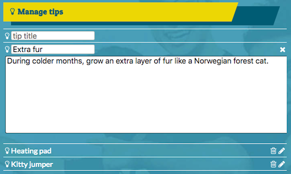

[**intro**](readme.md) | [**development options**](development-options.md) | **completed features**

* auto-gen TOC:
{:toc}

# Completed features
{:.no_toc}

## Shorter competitions

These changes support the above option, enabling admins to optionally show and hide competitons from the public student view during testing and preparation, or when they are finished.

Above: the competition manager *before* new features

Above: the competition manager *showing the new controls*

- competitions can now be published/unpublished in the admin interface
- the main competition cannot be unpublished
- if an unpublished competition becomes main, it is automatically published
- unpublished competitons no longer appear on the public list of competitions
- the main competition icon 'tick' has been replaced by a white trophy icon

### Features pending

([see full details in "Development Options"](development-options.md#shorter-competitions))

- Enable archiving of competitions (as well as publishing/unpublishing) and present archived competitions in a secondary list publicly viewable through an additional click.
- Competitions are (optionally) operated on a rolling basis, operating the leaderboard on recent savings (e.g. the latest 28 days) rather than total cumulative savings.

---

## Integration with the campaign

Multiple features were suggested, as completed, each is covered below

### Wide-screen display

For each competition there is now a dedicated "full screen" link for showing the competition on large (e.g. plasma) screens. This addresses one of the points listed under this item:

> a wide-screen display with a thin leaderboard alongside a customisable area, possibly with scrolling, customisable messages 

Above: the iframe is unsuitable for wide screen sizes

Above: the "large screen" link is designed for wide screen sizes

- all competitions now have a dedicated "full screen" page (above)
- there is an automatic "maximum width" limit, in case displays exceed 2000 pixels wide
- the university logo and competition message is displayed alongside the competition
- on larger screens, hall images are no longer cropped into a "letterbox" view
- less cropped hall images mean the iFrame also looks better on wider screens

### Customisable energy-saving tips

> possibly with scrolling, customisable messages

Each university can now manage a series of encouraging energy-saving messages via "tips" in the admin screens. These are visible on the public competition page and the wide-screen display, but omitted from the iframe version as this is designed to show only the leaderboard itself.

Above: tips appear next to all competitions under the university logo

Above: tips on the wide-screen display are in a larger font and cycle automatically

Above: the new "tips" admin tab is highlighted here, above the university logo

Above: tips admin screen includes a brief "title" field for easier identification

- you can add, edit and delete any tip from the "tips" admin screen
- tip titles are for admins to help navigate the list of tips e.g. a tip with the admin title "Summer campaign 2018 tip 1" might have a public message encouraging students to "Stay cool - eat more ice-cream!"
- the "home" tab is gone—the university logo now opens the university home page
- the tips cycle through all available tips, and can be paused/played by the user
- tips on the wide-screen version play automatically and the controls are hidden

### Features yet to be prioritised

([see full details in "Integration with the campaign"](development-options.md#integration-with-the-campaign))

- A "podium" style widget showing only the top three
- A single competitor widget showing one hall in a competition
- A summary of the aggregate data for one competition

---

[top of page](#)
